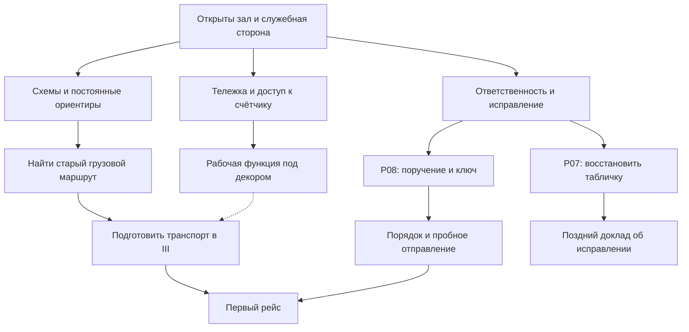
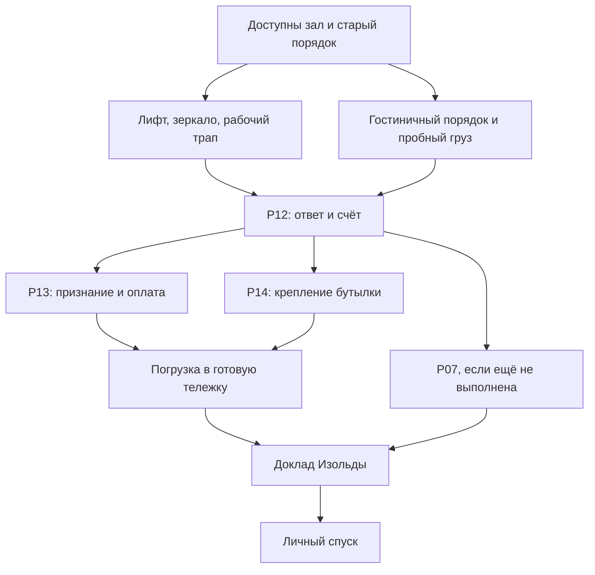

# Независимый аудит загадок «Латунный янычар: Гидроудар»

**Дата:** 8 октября 2026 года.  
**Основание:** `BJ3_PUZZLE_AUDIT.md`, версия 1 от 08.10.2026, включая предварительный аудит, ограничения автора и полное Приложение А.  
**Статус:** рекомендуемая переработка дизайна. Изменения в репозиторий не внесены. Машинные идентификаторы ниже относятся к приложенной спецификации; новые идентификаторы — предложения, а не существующие поля проекта.

## 1. Главный вывод

У игры уже есть сильная причинная и комедийная основа: человек прячется внутри гостиничного сервиса, постепенно возвращает этому сервису рабочее назначение и добивается признания человека, которого сам отель предпочёл не замечать. Особенно хорошо работают тележка, избирательное внимание Изольды и финальный обмен рабочими знаками.

Главный недостаток нынешней цепочки — **несовпадение между тем, что игрок должен понять, и тем, что граф требует от него отметить**. Во втором акте полезные наблюдения превращены в пропуска к разговору; в третьем разные по смыслу задачи выстроены почти в очередь; некоторые сильные сцены посчитаны загадками. Несколько нарушений физики подрывают доверие к ограничениям мыльного хвата.

Рекомендую сохранить сюжет и основные сцены, переработать P06, P10 и P14, исправить геометрию P05 и P09, снять скрытые познавательные условия с уже доступных действий. P04 превратить в диагностическую сцену. P01, P12, P15 и P16 также считать сценами. Получение вантуза A01 превратить в короткую задачу N01 «Впустить воздух», описанную в §6.8: она использует уже существующие вантуз, панель и ламинированное меню. Это даёт 12 задач в полном содержании без искусственного деления P02/P09 или переименования кнопок лифта в загадку.

**Структура:** два пересечения ветвей в III акте; несколько нитей из II акта продолжаются до этих пересечений. IV акт — короткий финал с одной полноценной задачей P17. Искусственно добавлять в него показания, манометр и дополнительные формы не следует.

### Что я сохраняю без изменений по существу

Посылку, персонажей, наготу до победы, укрытие под тележкой, мыльный хват, личную недоступность Кухтулху до IV акта, точную записку про оплату водой, авторские строки, вантуз как подпись, наружную кнопку лифта и ожидание закрытия решётки. Все предлагаемые перемещения показываются сменами статичных состояний. Новые широкие экраны и новые персонажи не нужны.

### Как читать оценки

«Не загадка» не означает «удалить». Сцена может обучать, менять цель, раскрывать характер и давать отличную комедию. Отдельный вопрос — совершает ли игрок самостоятельный вывод. Информационная награда также допустима: она должна помогать принять последующее решение, а не служить невидимым разрешением на правильный клик.

Все утверждения о текущей версии ниже опираются на указанные карточки и действия Приложения А. Предлагаемые состояния, геометрия и последовательности помечены как изменения.

## 2. Вердикты по всем 16 карточкам

P11 в исходной нумерации отсутствует. Проверены P01–P10 и P12–P17: ровно 16 карточек.

| Загадка | Зачем она нужна | Интеллектуальное усилие сейчас | Комизм | Вердикт | Что сделать |
|---|---|---|---|---|---|
| **P01. Пена** | Объясняет хват и правило струи; расширяет цель до восстановления воды | Решения нет: разрешённые пробы дают один исход | Удачный рост позора после попытки привести себя в порядок | **Сцена обучения** | Сохранить; не требовать провала для выхода, если игрок уже понял правило |
| **P02. Четыре звезды** | Даёт укрытие, проход и инвентарную пластину | Небольшой, но настоящий перенос: прятаться внутри конструкции; уменьшить габарит | Один из лучших немых результатов: рекламная роскошь мешает пользоваться вещью | **Хорошая вступительная загадка** | Сохранить простоту; убрать обязательные звонок, обход всех отказов и неудачу с юбкой |
| **P03. «Горячее!»** | Открывает служебную сторону, W3 и W4 | Применить увиденный социальный сигнал к собственному положению | Обслуживание замечают, обслуживающего человека — нет | **Хорошая простая загадка** | Сохранить; нужный сигнал не должен появляться единственным очевидным вариантом после скрытого флага |
| **P04. Один удар** | Локализует общую проблему; показывает заявки, ящик и печать | Сейчас вывод проверяется викториной; доказательство намеренного перекрытия недостаточно | Три коммерческие услуги оказываются одной трубой и одним автоответчиком | **Слабая как загадка; хорошая диагностическая сцена** | Убрать `CHOICE.cause.*`; ограничить ранний вывод общей остановкой до ответвлений |
| **P05. Три плана** | Строит пространственную модель; помогает найти старый маршрут | Хорошая задача на неподвижные ориентиры | Под декоративными переименованиями проявляется одна инфраструктура | **Годится; после исправления геометрии — хорошая** | Совмещать изображения на согласованных схемах, не изображение источника с настоящим люком; убрать запрет открыть видимую дверь без `topology_known` |
| **P06. Экспонат** | Даёт доступ к рабочему узлу и сведения о рабочем знаке | Нажатие почти совпадает с первым кликом; круг вантуза не доказывает автора пломбы | Сильная основа для сцены скрытой работы в публичном месте | **Не загадка в нынешнем исполнении** | Сделать задачу на положение тележки и ход дверцы; убрать обязательное сравнение вантузом |
| **P07. Свежая краска** | Возвращает должность стёртому работнику; раскрывает участие Изольды | Подбор жёсткой влагостойкой кромки | Меню, исключившее кефир, очищает табличку его получателя | **Годится** | Сохранить физическое восстановление таблички; дать ему позднее признание; не запрещать пригодный жетон произвольным объяснением |
| **P08. Свидетель** | Даёт ключ и передаёт герою оставшуюся без исполнителя работу | Есть модель защитного поведения NPC; сейчас её заслоняет список условий | Ключ выдаётся тележке, чтобы проблема уехала | **Хорошая основа, слабое условие допуска** | Выдача ключа должна зависеть от сыгранной передачи ответственности; убрать посторонние находки из допуска к разговору |
| **P09. Зеркало** | Открывает грузовой маршрут | Найти скрытый проход и превратить присоску в ручку | Инструмент санузла вскрывает гостиничный дизайн | **Годится** | Зеркало всё время опирается на направляющую; не показывать полнофигурного героя; разрешить раннюю правильную попытку |
| **P10. Мел и наклейки** | Освобождает кабину | Переносной декор конкурирует с несъёмными деталями; реального различения почти нет | Работу спрятали, декор охраняют | **Не загадка в нынешнем исполнении** | Добавить среди перемещаемых вещей функциональный трап; обеспечить две разные обратимые ошибки |
| **P12. «Каскадъ»** | Устанавливает прямую связь, приносит счёт и меняет цель | Победить нельзя; нынешний ход требует игнорировать прямое указание на кефир | Сильная низшая точка с точным авторским ответом | **Сцена-поворот, требующая лучшей мотивации** | Испытывать действующий гостиничный порядок и получать ответ; не заставлять игрока верить, что вода точно заменяет кефир |
| **P13. Счёт под печать** | Превращает избегание ответственности в признание; даёт оплату | Использовать устойчивую привычку NPC | Изольда удостоверяет то, чего не хотела замечать | **Хорошая** | Сохранить; существенная строка должна действительно попадать в область её внимания; объединить два флага знания о печати |
| **P14. Погрузка** | Переводит оплату на транспорт | Подкатить уже имеющуюся тележку к готовому помощнику почти не требует вывода | Комический образ работает лучше, чем задача | **Слабая; сейчас логистическая связка** | Превратить в восстановление штатного крепления бутылки; Изольда по-прежнему без препятствий помогает грузить |
| **P15. Персонал** | Доставляет героя лично; завершает колбэк его статуса | Повтор укрытия и исполнение уже объяснённой физики | Сильная буквальная законопослушность | **Управляемая сцена-переход** | Дать игроку собрать отправление вместе с собой; открыто показать ожидающую команду; не делать интерлок тайной загадкой и не считать его двенадцатым инсайтом |
| **P16. Доложиться** | Завершает дугу стыда; делает героя видимым | После прямого приглашения остаётся выйти; нового сложного вывода нет | Сильная нормальность водолечебницы вместо ожидаемого унижения | **Кульминационная сцена** | Сохранить короткой; не добавлять препятствий ради счётчика загадок |
| **P17. Рабочие знаки** | Завершает приёмку и освобождает задвижку | Переосмыслить свой инструмент как собственный знак | Две стороны признают работу двумя мокрыми оттисками | **Хорошая после небольшой правки оснований** | Требуется свой различимый знак, а не копия чужой подписи; правильный вантуз принимается без обязательного раннего сравнения |

## 3. Что нужно поправить в предварительном аудите

### 3.1. P01 даёт игре конкретную пользу

В карточке P01 меняются состояние пены и масштаб цели, показывается мыльный хват. Формулировка «ничего не даёт» неверна. Верный диагноз: полезная сцена ошибочно занимает место в счётчике интеллектуальных загадок.

### 3.2. Девять условий B14 — не девять независимых находок

В `B14_present_model` действительно девять условий. Два из них — `trolley_service_side` и `iz_formal` — описывают доступ и состояние Изольды. Семь относятся к сведениям. Часть условий транзитивно избыточна: `photo_seen` уже следует из пути к `topology_known`, а `paint_act_read` — из пути к `name_revealed`.

После сокращения повторных зависимостей разговор собирает четыре окончания ветвей: B06, B09, B12 и B13. Проблема сохраняется: в самом убеждении непосредственно работает распоряжение о сокращении, а разговор проверяет ещё несколько завершённых ветвей. Точная формулировка полезнее завышения числа «ключей».

### 3.3. P04 и P06 связаны с поздней игрой

`seal_is_mark` из B09 нужен не только B14, но и E05. `knows_push_latch` из B03 открывает B08, ведущий к B09. Поэтому нельзя просто исключить эти ветви из расследования, оставив старые условия финала.

Исправление — разделить раннее обучение и физическую допустимость действия. Обследование витрины помогает понять рабочие знаки; оно не должно быть тайным разрешением расписаться уже имеющимся вантузом.

### 3.4. Вантуз пока не является универсальной отмычкой

Самостоятельные решения с ним — P09 и P17. В P06 он участвует в сравнении. Более точный риск: обязательный опыт B09 слишком прямо репетирует финальную подпись и одновременно плохо доказывает тождество автора следов. Убрать стоит этот опыт, а не разнообразные поздние применения инструмента.

### 3.5. P12 нельзя автоматически объявить честной

К моменту пробы C01 прямо требует кефир; B14 рассказывает о кефире, показаниях и приветствии; журнал повторяет кефир. Игрок, понявший эти сведения, не обязан считать любую бутылку равноценной. Точный текст советской памятки и нынешнего регламента в приложении отсутствует, а их чтение необязательно. Значит, заявленная конкуренция двух равноправных версий пока не обеспечена.

### 3.6. Информационные задачи не следует запрещать

Критерий §2.2.6 разрешает награду в виде сведения, которое потом применяется действием. Это особенно важно для P05 и P06. Их полезность не требует спрятать правильное взаимодействие до флага «прочитано». Угаданный по другим основаниям правильный ход должен работать.

### 3.7. Вердикты по восьми стартовым предложениям Claude

| Предложение §4 исходника | Решение аудита | Причина |
|---|---|---|
| Функциональная доска с мелом вместо различения декора и несъёмного рубильника | **Принять и уточнить** | Нужны две перемещаемые категории, две видимые ошибки и трап до первого рейса |
| Отвлечь гостей каскадом, пока герой открывает витрину | **Отклонить в пользу пространственного решения** | Формулировка «в эти секунды» вводит запрещённый тайминг; физическое укрытие даёт более ясный самостоятельный результат |
| Убрать викторину P04 | **Принять как перевод в сцену** | Не создавать второй пазл предъявления бумаг и не требовать выбора недоказанного умысла |
| Оставить для P08 действующий аргумент о сокращении | **Принять** | Он работает с характером; остальные находки получают собственные поздние применения |
| Разнести кефир, печать и доклад на три ветви | **Заменить** | Эти действия слишком легко становятся тремя стадиями одной административной сделки; нужна независимая подготовка транспорта, а восстановление таблички продолжает раннюю физическую ветвь |
| Добавить две ветви перед финальным пуском | **Отклонить** | Показания и новая инженерная проверка задерживают уже заработанную развязку; линейный финал здесь оправдан |
| P01/P12 считать сценами, P14 оставить короткой связкой | **Частично принять** | Статус сцен верен; P12 требует честной мотивации, а P14 получает собственную механику крепления |
| Усилить предметные нити через акты | **Принять** | Меню работает при получении вантуза и очистке таблички; фото помогает восстановить устройство тележки; новые инвентарные предметы не нужны |

## 4. Карты ветвей и точки схождения

### 4.1. Пересчёт текущей структуры

В приложении перечислены **46 обязательных макроузлов: 10 + 15 + 15 + 6**. Для каждого акта построена проекция положительных зависимостей: производитель флага предшествует его потребителю. Пары, между которыми нет пути ни в одну сторону, считаются переставляемыми.

| Акт | Узлы | Переставляемые пары | Доля | Наибольшая цепь |
|---|---:|---:|---:|---:|
| I | 10 | 20 из 45 | 44,4% | 5 |
| II | 15 | 63 из 105 | 60,0% | 6 |
| III | 15 | 6 из 105 | 5,7% | 13 |
| IV | 6 | 0 из 15 | 0% | 6 |

Эти числа воспроизводят предварительный аудит. **Это не запуск полного игрового солвера:** в приложении нет начального состояния, удаляемых эффектов, полной модели местонахождения и эффектов всех альтернатив. Переставляемость кликов также не равна количеству содержательных ветвей.

Две из шести пар III акта — C11/C12 и C11/C13 — позволяют наблюдать и использовать печать до возврата тележки к стойке. Если отдельный безопасный пеший маршрут не предусмотрен, нужно ребро C11 → C12; тогда остаются четыре переставляемые пары из 105. Эти четыре пары — всего лишь возможность погрузить воду, пока открывается лифт.

Если меню взято в I акте, B10 пропускается: во II остаётся 14 узлов и 52 переставляемые пары из 91 в той же проекции. Это перенос приобретения предмета, а не дополнительная ветвь.

### 4.2. Акт I

**Как есть.** Осмотры и неудачи A01–A07 сходятся в A08. Затем последовательно A09 и A10. Тележка не может выехать, пока герой не позвонил, не испытал жидкость, не узнал правило пены и не провалил попытку снять юбку.

**Как предлагается.** Короткая развилка на два разных затруднения, с отдельной ранней нитью инструмента:

- **Пространство и предмет:** понять устройство укрытия, сложить выступающие звёзды, занять место под тележкой.
- **Социальное наблюдение:** увидеть, какой сигнал освобождает проход, и как Изольда обращается с обслуживающим персоналом.

**Ранняя физическая нить N01:** меню → впустить воздух под присоску → получить вантуз. Она продолжается до зеркала P09 и подписи P17; её не нужно превращать в искусственное условие проезда тележки.

**Схождение:** у толпы нужны пригодная тележка и применённый социальный сигнал. Если игрок понял решение раньше демонстрации, оно работает. Пробы жидкостей и звонок остаются обучающими и комическими действиями, но не отдельными замками на выходе.

Вступление не нужно превращать в три большие параллельные линии: его задача — быстро дать основной способ действия и удовольствие от первой самостоятельной победы.

### 4.3. Акт II

**Как есть.** Четыре окончания ветвей сходятся в B14: топология; пломба через обследование каскада/прачечной и витрины; краска; распоряжение. Разговор выдаёт ключ только после всех четырёх.

**Как предлагается.** Один общий узел B14 перестаёт запирать остальные ветви. Из зала и служебной стороны доступны три линии:

| Ветвь | Операция игрока | Собственный результат | Где результат применяется |
|---|---|---|---|
| **Пространственная** | Совместить схемы по постоянной инфраструктуре | Понятная топология старого служебного маршрута | Поиск лестницы и скрытого лифта P09; осмысленная проверка альтернатив |
| **Рабочее устройство** | Устроить укрытие у витрины и открыть её | Доступ к действующему узлу; различение рабочего знака и декоративного запрета | Общий принцип помогает оценить предметы P10; конкретный лучистый рисунок узнаётся в P17 |
| **Ответственность** | Восстановить табличку; сыграть передачу брошенной обязанности | Физически возвращённая должность; ключ и конкретное поручение | Порядок у двери, пробный рейс; поздний доклад Изольды о восстановленном положении дел |

Снятие краски и разговор могут выполняться в любом порядке. Ключ не ждёт очищенной таблички. Табличка сохраняет самостоятельный сюжетный результат: исправлена часть того отказа от отношений, который Кухтулху позже перечисляет в счёте.

Пунктир обозначает помощь общего принципа, а не обязательное предусловие: трап выбирается по собственной геометрии и меловым меткам. Очистка таблички не является предпосылкой ключа. Здесь линии сходятся в осмысленных действиях III акта. Часть информационных подготовок опытный игрок сможет сократить. Это допустимое следствие снятия скрытых флагов, а не повод вернуть их под другим названием.

### 4.4. Акт III

**Как есть.** Почти вся цепочка последовательна: инструкция → лестница → зеркало → кабина → вода → счёт → стойка → печать → погрузка → объявление → спуск.

**Как предлагается.** Два настоящих пересечения, с поздним завершением уже открытой ветви таблички.

**Первое, до P12:**

- **Пространство и физика:** найти лифт, сдвинуть зеркало, очистить кабину, сохранить рабочий трап.
- **Проверка процедуры и подготовка отправления:** прочитать доступный порядок, увидеть его расхождение с текущим гостиничным регламентом, переместить выставленную воду на тележку с непрерывной опорой.

Они сходятся в пробном рейсе: нужны и транспорт, и конкретное отправление. Подготовка воды — короткая логистическая ветвь, а не «ещё одна большая загадка».

**Второе, после P12:**

- **Социальная ветвь P13:** добиться, чтобы Изольда приняла проблему; получить кефир и документы.
- **Физическая ветвь P14:** освободить рабочую часть тележки и вернуть штатное крепление стеклянного груза. Разгрузка сама по себе отдельной загадкой не считается.

Они сходятся в погрузке. Кроме того, до общего доклада должно быть завершено P07: если табличка восстановлена раньше, её состояние уже удовлетворяет прямо названному условию счёта; если нет, появляется ясная цель исправления. Восстановление крепления не требует признания Изольды; признание не требует готового крепления. При желании крепление можно подготовить ещё до первого рейса: игра обязана сохранить это состояние.

P10 остаётся **до** пробного рейса. Переносить трап после рейса под предлогом веса героя нельзя: тележка уже проехала по этому пути, а герой по канону может сначала вкатить её снаружи и только затем залезть внутрь.

### 4.5. Акт IV

**Как есть.** E01 → E02 → E03 → E04 → E05 → E06.

**Как предлагается.** Приём груза → самостоятельный выход из укрытия и приветствие → контора → собственный рабочий знак → вода. Линейность сохраняется намеренно.

Это финальный акт по драматургии и короткий эпилог по устройству задач. Один новый вопрос — чем поставить свой знак — собирает ранние свойства. Остальные действия выплачивают накопленный эффект тележки, стыда и личного присутствия. Новая развилка с показаниями только увеличила бы расстояние между кульминацией и водой.

## 5. Нити, работающие через акты

| Ранний элемент | Позднее применение | Что переосмысляется | Обязательный видимый результат |
|---|---|---|---|
| Жёсткая юбка, P02 | Пространственный карман у витрины, P06 | Укрытие становится средством организации рабочего места | Дверца открывается, тело остаётся закрыто |
| Складывающиеся звёзды и пластина, P02 | Узнавание тележки Кухтулху | Рекламная вещь снова получает свою историю и владельца | Узнана именно восстановленная старая тележка |
| Меню, I акт | Впустить воздух в N01, затем скребок P07 | Тонкая влагостойкая кромка сначала освобождает инструмент, затем восстанавливает табличку | Снятая присоска, позже очищенная табличка и испачканная кромка |
| Совмещённые схемы, P05 | Поиск грузового маршрута, P09 | Гостевая карта превращается в инженерный инструмент | Установлено местоположение действительного прохода |
| Фото «Четвергъ», II акт | Крепление бутылки, P14 | Историческое изображение становится инструкцией по устройству вещи | Восстановлена старая конфигурация тележки |
| Работающий узел за музейным оформлением, P06 | Рабочий трап среди декора, P10 | Пригодность определяется функцией, а не гостиничной наклейкой | Декор убран, проезд остаётся работоспособным |
| Восстановленная табличка, P07 | Признание отелем возобновлённых отношений после счёта | Раннее физическое действие получает человеческий и хозяйственный смысл | Изольда сообщает о действительно исправленном состоянии, табличка остаётся видна |
| Привычка Изольды к месту печати, II акт | Счёт P13 | Рабочий автоматизм обращается против избегания ответственности | Она принимает и читает свой участок счёта |
| Обслуживающего человека не замечают, P03/P08 | P15, затем P16 | Сначала герой пользуется исчезновением человека; внизу сам от него отказывается | Отправляется в укрытии, выходит по собственной инициативе |
| Мокрый след вантуза, A01 | Личный знак P17 | Инструмент захвата становится средством удостоверить свою работу | Его круг и её лучистый оттиск стоят в разных графах |

Для этих нитей не нужны дополнительные обязательные реликвии. R1–R3 можно сохранить необязательными: они не должны незаметно стать ключами к основной развязке.

## 6. Конкретные изменения по грамматике звена

Ниже указана одна рекомендуемая версия. «Цена» означает объём новой постановки, текстовых реакций и графовых изменений; это не оценка человеко-дней без знакомства с движком и готовой графикой.

### 6.1. P01–P03: сохранить быстрый вход и освободить правильный ход

**Цель → препятствие.** Добраться до администратора. Герой голый, одежда недоступна, рекламные звёзды расширяют тележку, гости не реагируют на обычную просьбу.

**Два основания.** Устройство жёсткой юбки и нижнего поручня видно непосредственно; петли и следы движения звёзд объясняют изменение габарита. Для прохода через толпу отдельно работают наблюдение официанта и надпись на кофейнике.

**Ошибка → эксперимент → ответ.** Попытка снять юбку показывает её крепление; попытка протиснуть широкую тележку — упор звёзд; обычная просьба — неподвижную толпу. Это доступные проверки, а не обязательная лестница поражений.

**Новая гипотеза → изменение → награда → новая цель.** Человек перемещается внутри укрытия, звёзды сложены; затем он применяет служебный сигнал. Открывается реальный маршрут к стойке и служебным помещениям. Новая цель — обследовать остановившуюся систему.

**Комический механизм и немая сцена.** Реклама физически мешает сервису; человек приобретает проходимость вместе с исчезновением своего статуса. Достаточны состояния широкой/узкой тележки и сомкнутой/расступившейся толпы.

**Граф.** Удалить из физического выхода A08 требования `reception_called`, `foam_class_closed`, `knows_foam_flow`. `knows_trolley_chamber` использовать для подсказок, а не для запрета залезть в видимое пространство. У A05 убрать связь с `voucher_read`. Успех P03 определяется применённым сигналом и присутствием у толпы; наблюдение официанта не должно быть обязательным токеном разрешения.

**Цена.** Низкая: преимущественно граф и тексты ранних ответов. Состояния пены зависят от того, была ли проба; не заставлять более догадливого игрока увеличивать шапку ради единственного позднего кадра.

### 6.2. P04: диагностика с корректным выводом

**Цель → препятствие.** Понять масштаб остановки. Изольда распределяет одну общую жалобу между тремя названиями услуг.

**Два основания.** Насос работает без подачи; прачечная сообщает об отсутствии подачи. Удар и отсутствие воды в номере дополняют картину. Одна минута на таймерах и след на камнях не доказывают ни одну секунду остановки, ни умысел.

**Ошибка → эксперимент → ответ.** Попробовать запустить отдельную услугу; устройство отвечает, но воды не получает. Это сужает поиск до общего участка системы. Позднее уведомление под папкой и пломба позволяют уточнить характер остановки.

**Новая гипотеза → изменение → награда → новая цель.** Изольда прекращает изображать три независимых неисправности и соединяет заявки. Игрок получает объяснение масштаба задачи и наблюдает её рабочие привычки. Следующая цель — найти общую инфраструктуру и исполнителя. Этот переход не считать самостоятельной загадкой.

**Комический механизм и немая сцена.** Три логотипа над одной неисправностью; после скрепления бланков автоответчик остаётся тем же.

**Граф.** Удалить викторину, обозначенную в предварительном аудите как `CHOICE.cause.*`. B01/B02 остаются доступными обследованиями. B03 не должен быть обязательным предшественником открытия витрины. Вместо двух знаний `knows_iz_stamp_mp` и `knows_mp_habit` использовать одно знание привычки, с несколькими возможностями его получить.

**Цена.** Низкая: тексты и условия. Никакого нового общего выключателя, который по совпадению открывает следующую дверь, не добавлять.

### 6.3. P05: совмещать три изображения, а не карту и местность

**Цель → препятствие.** Восстановить пространственную модель служебного пути. Декоративные рамки, фасады и подписи разных эпох дают неверные ориентиры.

**Два основания.** На всех трёх носителях есть одинаковая точка источника и один неизменный узел стояка. Само рабочее изображение выполнено в общей проекции и масштабе: например, это три редакции одного продольного разреза. Декоративная оболочка могла изменяться, расстояние между двумя техническими опорами — нет.

**Ошибка → эксперимент → ответ.** Сложить по рамкам: технические метки расходятся. Совместить только источник: направления стояка расходятся. Ответ виден в изображении, а не в сообщении «неправильно».

**Новая гипотеза → изменение → награда → новая цель.** Совместить изображения источника, затем довернуть по второму неподвижному узлу. Получается читаемая общая схема с конторой, лестницей и служебными связями. Новая цель — проверить показанный маршрут и найти транспортный проход.

**Физика.** Стекло над люком служит подсветкой. Настоящий люк не является точкой масштаба чертежа. Старые носители заранее помещены в защищённые держатели на рабочей поверхности; герой двигает латунные или ламинированные края, не переносит мокрыми руками бумажную восковку. Карта отеля остаётся переносимой. Для интерфейса нужны крупные дискретные положения с видимой привязкой, без точного попадания по пикселям.

**Комический механизм и немая сцена.** Красивые фасады разъезжаются; под ними выпрямляется одна давно существующая служебная система. Авторская шутка о переводе «велнес» сохраняется в момент наложения названий.

**Граф.** Переписать постановку B05/B06; `topology_known` оставить для подсказок и содержательных реакций. Убрать его из механического отпирания B15. Фотография доступна при открытии её реального места хранения, а не выдаётся невидимо за решение: сейчас `photo_seen` возникает уже в B05.

**Цена.** Средняя: заново сверстать три согласованные схемы и состояния Z10. Нового широкого экрана или зума не требуется.

### 6.4. P06: открыть витрину, сохранив укрытие

**Цель → препятствие.** Добраться до рабочего счётчика в людном вестибюле. Нужно одновременно освободить ход распашной дверцы и сохранить закрытый путь для тела героя.

**Два основания.** Петля и сектор движения дверцы видны до решения. Жёсткая распахивающаяся юбка уже известна из I акта; глухая боковая часть тумбы может закрыть оставшееся направление взгляда.

**Ошибка → эксперимент → ответ.** Фронтальная парковка позволяет дотянуться до защёлки, но дверца упирается в раму тележки. Отъезд назад освобождает дверцу, но лишает героя закрытого доступа. Вторая ошибка должна означать видимость тела при попытке выйти, а не произвольный запрет показать одну руку: мыльные руки он уже использует у стойки.

**Новая гипотеза → изменение → награда → новая цель.** Поставить тележку боком к глухой тумбе, раскрыть юбку как дополнительную стенку и нажать защёлку. Получается закрытый угловой карман; дверца открывается в свободную сторону. Счётчик доступен для обследования. Его рабочая пломба и старые оттиски позволяют понять, кто оставляет этот знак и что гостиничное оформление скрывает действующее устройство.

**Комический механизм и немая сцена.** Посреди парадного вестибюля тележка незаметно превращается в маленькое рабочее помещение. Публика остаётся на месте; герой решил пространственную задачу.

**Граф.** Добавить конечные положения `vitrine_parking = front / away / side`, положение юбки и состояние дверцы. Правильное открытие зависит от свободного хода дверцы, достижимости и укрытия. `knows_push_latch` не требуется. Удалить обязательный B09 с вантузом; сравнивать характерный лучистый рисунок счётчика и журнала без прикладывания инструмента. Из E05 убрать требование раннего `seal_is_mark` для правильного действия.

**Цена.** Средняя: примерно 3–4 основных состояния Z05, плюс варианты открытой дверцы. До текста нужно нарисовать схему сверху с секторами поворота. Если требуемая геометрия не получается, эту версию нельзя объявлять готовой по одному описанию.

### 6.5. P07 и P08: восстановить работника и передать его оставшуюся работу

**Цель → препятствие.** Прочитать закрытую должность и получить доступ к исполнению брошенной обязанности. Краску нанесла гостиница; Изольда защищается от персональной вины.

**Два основания.** Для краски — мягкость слоя и жёсткая влагостойкая кромка меню. Для разговора — распоряжение о сокращении без передачи функций и уже показанная привычка Изольды передавать проблему обслуживающему персоналу.

**Ошибка → эксперимент → ответ.** Пальцы размазывают краску. Обвинение по малярному акту заставляет Изольду закрыть папку и вернуть ключ под её защиту. Ответ должен прямо показывать, что она защищает свою роль, а не опровергает факты.

**Новая гипотеза → изменение → награда → новая цель.** Меню снимает краску. В разговоре игрок предлагает выполнить оставшуюся без исполнителя работу, позволяя Изольде сослаться на распоряжение. Она отдаёт ключ и передаёт обязанность. Новая цель — проверить старый порядок у двери. Табличка, если восстановлена, остаётся восстановленной независимо от порядка разговора.

**Поздняя польза P07.** В предлагаемой редакции счёт явно называет два исправимых основания приостановки: неоплаченное текущее исполнение и стёртую должность, воспринятую как отказ от отношений. Чтобы сообщить об устранении второй причины, нужно действительно очистить табличку. Это проверка состояния мира `board_restored`, а не проверка прочтения имени. Если игрок не сделал P07 во II акте, счёт даёт ему ясную текущую цель; дверь и ключ до этого не блокируются. Лапидус сообщает Изольде о выполненной работе при подготовке общего доклада; её сообщение поставщику передаёт его отчёт. Она не должна магически узнавать состояние по флагу или покидать стойку вопреки установленной занятости.

**Комический механизм и немая сцена.** Меню лишило работника кефира и этим же предметом ему возвращают место на доске. Изольда выдаёт ключ тому, кого по-прежнему старается не разглядывать.

**Граф.** Развести `board_restored` и сведения о прочитанном. `B14_present_model` не требует завершения P05/P06/P07. Содержательная стратегия передачи работы даёт ключ. Поздний доклад о восстановленных отношениях использует реальное состояние таблички, и требование явно предъявлено в счёте. Это **новое условие предлагаемой версии**, отсутствующее в нынешнем перечне трёх требований счёта. Если R1 уже добыт и его кромка пригодна для свежей краски, разрешить альтернативное соскребание; не создавать ложную физику ради обязательного меню.

**Цена.** Низкая или средняя: уточнение счёта, реакций Изольды и графа. Основные изображения доски и ключа уже нужны исходной версии. Добавленный пункт счёта компенсируется удалением старого списка условий B14; новой справки или предмета не появляется.

### 6.6. P09 и P10: открыть технику и сохранить то, на чём она работает

**Цель → препятствие.** Подготовить старый грузовой путь. Его закрывает зеркало, кабина занята декором, среди перемещаемых вещей есть функциональный трап.

**Два основания для P09.** Фото «Четвергъ» и сохранившиеся признаки пола указывают на старый проход. Свойство присоски известно из A01; видимые нижняя направляющая и верхний удерживающий профиль показывают, что зеркало можно сдвинуть, не поднимая целиком.

**Ошибка → ответ P09.** Нажатие не открывает защёлку; попытка потянуть раму показывает, что основная масса опирается снизу. Присоска становится ручкой для поддерживаемого стекла. После сдвига открывается решётка. Полнофигурное отражение Лапидуса не нужно.

**Два основания для P10.** Сантехник помечал рабочие вещи мелом; доска с такой пометкой по форме и потёртостям соответствует зазору у порога. Прямая проверка геометрии важнее почтения к любому слову «НАШЕ».

**Две ошибки P10.** Оставить весь декор — тележка не помещается. Вынести всё, включая доску, — колесо останавливается у открытого зазора. В обоих случаях состояние обратимо; колесо не ломается, груз не падает, таймера нет.

**Новая гипотеза → изменение → награда → новая цель.** Убрать декоративный груз, вернуть функциональную доску в правильное положение. Кабина свободна и доступна для колёс. Новая цель — испытать отправление.

**Комический механизм и немая сцена.** В зал переезжает неприкосновенный «дизайн»; в рабочем проходе остаётся невзрачная доска уволенного сантехника. Наиболее достоверная часть модернизации — та, которую не модернизировали.

**Граф.** C04/C05 доступны по реальной геометрии и инструменту, без обязательного C02 «сначала попробуй лестницу». Вместо одного `cabin_free` различать `decor_cleared`, `ramp_position` и `route_passable`. C09 требует проходимого пути. Положение доски задаётся действием, а не неизменяемым флагом «понял автора мела». Правильная догадка без разговора о меле принимается.

**Цена.** Средняя: опорное устройство зеркала, состояние свободного порога, доска в рабочем и вынутом положении. Всё в Z11. Переносить P10 после P12 не следует: это создало бы противоречие с уже состоявшимся рейсом.

### 6.7. P12: проигрывает гостиничная процедура, игрок получает прямой ответ

**Цель → препятствие.** Установить работающую связь и выяснить нынешние условия поставщика. Личный приём ещё закрыт; доступная гостиничная процедура противоречит старой практике.

**Два основания.** Старое предписание конкретно требует кефир и доклад. Нынешний ламинированный регламент прямо назначает гостиничный «комплимент» для нынешнего обслуживающего отправления. Советская памятка показывает промежуточный смысл: регулярная сдача конкретного предмета и личный доклад, постепенно превращённые администрацией в безличную процедуру.

Точные смыслы памятки и нынешнего регламента нужно вписать в канон: пока в приложении они только названы. Не требуется заставлять игрока отдельно прочитать все три бумаги. Действующий регламент и выставленный комплект должны быть видимым основанием самой пробы.

**Ошибка → эксперимент → ответ.** Проверить нынешний порядок с выставленной отелем водой. Лапидус может сомневаться в его правильности; игроку не нужно выбирать утверждение «вода наверняка подходит». Возвращается точная неприкосновенная записка и счёт. Ошибка процедуры стала результативным установлением связи.

**Новая гипотеза → изменение → награда → новая цель.** Перед героем поставщик с конкретными требованиями, а не обряд, который можно выполнить декоративно. Есть документ для предъявления отелю. Следующая цель — получить настоящее исполнение, исправить обозначенный отказ и подготовить доставку.

**Физика.** Новую бутылку берут у люка в W4, это не использованная бутылка A02. Добавить к выставленной воде видимый фирменный ложемент под её узкую форму: он фиксирует именно эту бутылку. Между стойкой и тележкой основание с бутылкой перемещается с непрерывной опорой; стекло не висит в мыльных пальцах. Вода уезжает и возвращается в своём держателе. Это одновременно объясняет успех первого рейса и даёт предметную отправную точку P14. Ложемент — новое предлагаемое свойство выставочного комплекта, его нельзя предполагать уже нарисованным. Если старое крепление тележки восстановлено заранее и подходит, оно тоже работает.

**Комический механизм и немая сцена.** Сомнительное подношение получает эмоциональную записку и безупречно точный хозяйственный документ. Завтрак и бутылка сохраняют следы всех предшествующих действий. Оттиск на завтраке появляется только если завтрак действительно ездил.

**Граф.** Сохранить событие низшей точки и точную реплику. C08/C09 работают как проверка доступной процедуры; `knows_assortment` не заменяет мотив. Счёт создаёт `supplier_terms_received`. Никакого требования знать имя для обращения к должности: препятствие — отсутствие личного доступа. `breakfast_stamped` выдаётся условно, по наличию подноса в рейсе.

**Цена.** Низкая или средняя: три согласованных смысла документов, видимый фирменный ложемент воды, опорный перенос и варианты возвращённой тележки. Новых персонажей и экранов нет.

### 6.8. Новая N01 «Впустить воздух» — короткая задача в I акте

**Назначение.** Усилить существующее получение вантуза A01: вместо простого снятия инструмента игрок применяет физическое свойство присоски. N01 — временное имя новой карточки, исторический пропуск P11 не переиспользуется. Это самостоятельная задача получения необходимого инструмента, а не добавленная стадия переодевания или ещё одна проверка лифта.

**Цель → препятствие.** Прочесть прикрытую пиктограмму, чтобы понять, чем снять пену; для этого освободить вантуз на гладкой душевой панели. Его чашка плотно присосалась; прямое вытягивание деформирует её, но край остаётся прижатым. Мыльными пальцами трудно подцепить плотно прилегающую кромку.

**Два основания.** При безопасной пробе видны деформация чашки и неизменное прилегание её края — сила удержания связана с закрытой полостью. У уже доступного ламинированного меню есть тонкая упругая кромка, способная приподнять небольшой участок края, и оно не размокает в руках. Признаки нужно показать до успешного применения, а не объяснить только после него.

**Ошибка → эксперимент → ответ.** Потянуть за рукоять: чашка растягивается и возвращается, панель и вантуз целы. Попытка ухватить край пальцами показывает проблему локального доступа. Не изображать свободный язычок для снятия, который герой почему-то игнорирует. Не утверждать, что никакой вантуз невозможно сорвать рукой при любых обстоятельствах.

**Новая гипотеза → изменение → награда → новая цель.** Приподнять лишь маленький участок края и впустить воздух. Игрок подводит кромку меню; чашка отпускает панель. Вантуз получен, на панели остался мокрый круг, пиктограмма открыта. Следующая цель — применить найденный инструмент к реальному препятствию; раннее правило присоски позже объяснит хват за зеркало.

**Честные альтернативы.** Если изображённая геометрия позволяет отогнуть край ногтем, сдвигом рукояти или другим уже доступным подходящим предметом, такой способ должен работать. Загадка проверяет разгерметизацию, а не знание единственного любимого предмета автора. Сильный рывок не превращать в серию обязательных повторов.

**Комический механизм и немая сцена.** Принадлежность гостиничного санузла держится за своё место надёжнее работающих служб; её освобождает рекламное меню. Основной эффект скромный: герой с серьёзной инженерной целью возится с прилипшим вантузом, а результатом остаётся его будущий рабочий знак. Эта задача служит обучению причинности и не обязана конкурировать по комизму с тележкой или счётом.

**Граф.** A01 получает реальное условие отсоединения чашки, а не произвольный флаг прочтения. Взять меню можно сразу; нормальный маршрут приобретает его в I акте. Успешное отделение даёт прежние `plunger_taken` и `wet_ring_seen`, открывает пиктограмму. Деформация чашки — обратимая проба. Если реализованы другие корректные способы разгерметизации, меню остаётся одним из решений, а не тайным обязательным жетоном. Запасное B10 необходимо только на маршрутах, где меню ещё не взято.

**Цена.** Низкая: состояния «присоска держится / деформирована / край приподнят / снята» в существующем Z01, короткие реакции, применение уже существующего предмета. Новых экранов, предметов и NPC нет. Дополнительную сложную конструкцию подноса вводить не требуется.

### 6.9. P13 и P14: человек принимает ответственность, тележка принимает груз

#### P13 — сохранить рабочую социальную ловушку

**Цель → препятствие.** Получить исполнение от отеля. Изольда возвращает переданный прямо счёт, не читая; её внимание ограничено рабочей областью печати.

**Два основания.** Ранняя демонстрация привычки к «М.П.» и компоновка самого счёта. Строка, разоблачающая личный платёж, должна лежать непосредственно в области, которую она действительно проверяет, либо открываться при её привычном действии со страницей. Одного обещания «после печати вдруг прочтёт соседний текст» недостаточно.

**Ошибка → эксперимент → ответ.** Дать счёт прямо — она возвращает его в служебный оборот. Подать другой стороной — в поле внимания попадает пустой/неподходящий участок, результата нет. Счёт цел и доступен для повторной попытки. Механика не требует поймать момент удара печатью: стопка и рабочий цикл устойчивы до действия игрока.

**Новая гипотеза → изменение → награда → новая цель.** Поместить нужную сторону счёта в доступный лоток рабочего потока. Изольда сама удостоверяет и замечает своё участие, готовит кефир и накладную. Следующая цель — доставить исполнение.

**Граф.** Объединить два знания привычки. C12 — повторная доступная подсказка, не обязательный новый просмотр. C13 требует счёт, доступ к правильному лотку и корректную подачу. Позиция героя и тележки проверяется отдельно от исторического флага доступа за стойку. Герой не выходит голым к гостям в момент признания; меняется отношение Изольды, а не автоматически поза героя.

**Цена.** Низкая или средняя: лицевая/обратная ориентация счёта, реальный путь руки и область внимания в Z04. Реплики в полном объёме здесь не проектируются.

#### P14 — восстановить штатное крепление

**Цель → препятствие.** Перевезти стеклянную бутылку, не придерживая её рукой. Плоская гостиничная сервировка скрыла старое грузовое назначение тележки. Поднос можно переместить целиком на подходящую опору; после признания Изольда также вправе помочь разобрать сервировку сухими руками. Это подготовительное действие, а не отдельный замок.

**Два основания.** На фото «Четвергъ» видна бутылка в исходной компоновке. Непосредственно на раме — нижнее гнездо, откидная латунная обойма, следы износа и подходящие размеры. Новое крепление несъёмное: оно не становится универсальной переносной тарой.

**Различие двух рейсов.** Узкая вода P12 ехала в подходящем фирменном ложементе. Стеклянный кефир имеет другую, более широкую форму: его основание не садится в этот ложемент. Обе формы и положение опор должны быть видны рядом. Это новое конкретное условие рисунка, которое нужно зафиксировать в карточках P12 и P14. Без него требование «теперь обязательно закрепи бутылку» после удачной перевозки такой же незакреплённой воды было бы произвольным.

**Ошибка → эксперимент → ответ.** Повторить способ перевозки воды — кефир упирается в край слишком узкого гнезда и не опирается устойчиво. Поставить рядом на плоскость — при пробном ходе он кренится до борта; положить — перекатывается. Проба стабильна и обратима. Изольда помогает переставлять стекло, если груз уже выдан; она не отказывается выполнять очевидную работу ради препятствия. Любое другое действительно надёжное размещение, возможное из показанных предметов и геометрии, тоже должно приниматься: задача требует устойчивого груза, а не конкретного имени флага.

**Новая гипотеза → изменение → награда → новая цель.** Вернуть нижнюю и верхнюю опоры в рабочую конфигурацию. Изольда ставит кефир в гнездо и под обойму, кладёт накладную. Бутылка зафиксирована, руки героя свободны для поручня. Следующая цель — совместная доставка груза и ответственного человека.

**Комический механизм и немая сцена.** Ради одной бутылки кефира с тележки снимают дорогой завтрак и восстанавливают хозяйственную конструкцию, для которой она была создана. Успех оставляет видимый результат на главном предмете игры.

**Граф.** Освобождение рабочей части даёт `cargo_deck_exposed`; настройка P14 — `bottle_retainer_ready`. Оба допустимых способа разгрузки дают одинаковое состояние. Социальная ветвь независимо даёт `kefir_ready` и `invoice_ready`. Их схождение при присутствии тележки у Изольды создаёт `bottle_secured` и `payment_loaded`; иной реализованный способ устойчивой фиксации выдаёт тот же результат. Погрузить заранее можно; незакреплённую бутылку потом переставляет Изольда. После готовности крепления не надо искусственно ждать признания для разрешения его осмотра или настройки.

**Цена.** Средняя: состояния гнезда и обоймы, различимые формы воды/кефира и состояния закреплённой/неустойчивой бутылки в Z03. Использовать одну согласованную модель тележки для завтрака, пробной воды и кефира. Не вводить новый запрет на перенос металлического подноса: мыльный хват сам по себе его не запрещает.

### 6.10. P15–P17: сохранить личную доставку и завершить обмен работой

**Цель → препятствие.** Привезти исполнение и лично доложиться; затем оставить свой знак. Грузовой лифт требует закрытой решётки, Лапидус буквально соблюдает запрет перевозки людей, перед Кухтулху привычка прятаться уже мешает общению.

**Основания.** Наружный пост и состояние ожидающей команды видны. Ранние сцены объяснили его роль обслуживающего персонала. В финале журнал показывает способ подтверждения работы, а вантуз уже оставлял отчётливый след.

**Безопасные пробы и ответы.** Если герой сначала залез под тележку и не нажал «Вниз», лифт просто не получил команду; можно вылезти. Если команда уже дана, открытая решётка сохраняет ожидание сколько угодно. Отправка оплаты без человека может дать частичную приёмку груза и возврат с требованием личного доклада; тогда игра обязана помнить, что кефир уже принят, а не требовать вторую бутылку. Попытка говорить из укрытия не заменяет личного выхода. Палец оставляет неразборчивое пятно, ручка скользит; вантуз даёт собственный различимый оттиск.

**Рекомендуемая последовательность.** Тележка в кабине → герой снаружи нажимает «Вниз» → забирается под тележку → закрывает доступную решётку изнутри. Внизу он выходит и приветствует Кухтулху. В конторе ставит свой знак, получает встречный оттиск, поворачивает освобождённый маховик.

**Что здесь является загадкой.** P17 — самостоятельное переосмысление инструмента. P15 — управляемый переход с авторской шуткой, P16 — кульминационная сцена. Разделение C16 на три нажатия не создаёт трёх интеллектуальных операций. Не делать секретом то, что лифт ждёт решётку: иначе интерлок и станет решением.

**Физика и роли.** Платит отель; Лапидус доставляет исполнение и отвечает за доклад. Кабина не распознаёт социальные категории: классификация «груз» существует в его голове. Вантуз не подделывает подпись Кухтулху. В графе докладчиков можно заранее показать разные рабочие знаки; её лучистый оттиск повторяется в другой графе.

**Комический механизм и немая сцена.** Сначала герой едет под собственной доставкой; затем оставляет укрытие. Финальный журнал объединяет два разных знака двух участников. После этого вода возвращается без нового списка дел.

**Граф.** Различать местонахождение героя, тележки и команду лифта. Сохранять частичную приёмку при отправке без героя. У E05 убрать обязательность раннего `seal_is_mark`: правильный собственный знак работает по местным основаниям. У E06 достаточно снятой пломбы и доступа; прочтение инструкции не должно запрещать повернуть уже освобождённый маховик.

**Цена.** Низкая или средняя: состояния ожидания и посадки, тексты частичной приёмки, правка журналов и графа. Новую инженерную задачу в финале не добавлять.

## 7. Обязательные правки графовой модели

### 7.1. Отделить знания, достижения и текущее состояние

В приложении `trolley_service_side`, `trolley_in_hall`, `trolley_back_at_counter` выдаются, но их снятие не показано. Если это текущие координаты, тележка не должна одновременно оставаться во всех местах. Если это исторические достижения, они не подходят для проверки текущего доступа к счёту или кабине.

Рекомендованная минимальная модель:

| Категория | Пример | Правило |
|---|---|---|
| Знание | `knows_stamp_habit`, `topology_known` | Управляет доступными пояснениями и подсказками; не запрещает физически правильное действие |
| Историческое достижение | `service_access_obtained`, `supplier_contact_established` | Может оставаться истинным после ухода |
| Текущее положение | `lap_location`, `trolley_location`, `lap_posture` | Значения взаимоисключающие; перемещение меняет их явно |
| Физическое устройство | `gate_open`, `ramp_position`, `bottle_retainer_ready` | Меняется действием или показанным ответом мира |
| Текущее поручение | `terms_received`, `board_restored`, `payment_prepared` | Требования должны быть названы в самой задаче; скрытого `all_clues_found` нет |

Это обозначения предлагаемой модели. Не следует механически внедрять их поверх существующего проекта без сверки его схемы состояний.

### 7.2. Главные замены условий

| Место | Удалить или изменить | Чем заменить |
|---|---|---|
| A01 | Автоматическое снятие прилипшего инструмента | Причинное отделение края/разгерметизация N01, с допустимыми альтернативами |
| A08 | Звонок, проба жидкости и перечень прочитанных оснований как пропуск к выезду | Реальное укрытие, проходимый габарит, положение героя |
| B08 | `knows_push_latch` как разрешение нажать | Достижимость защёлки, свободная дверца, обеспеченное укрытие |
| B09 | Обязательный опыт вантузом | Обследование рисунка пломбы; ранняя информация остаётся полезной, но не обязательной для E05 |
| B12 | `knows_paper_soaks` как условие правильного скребка | Подходящая кромка и доступная краска; результат `board_restored` |
| B14 | Посторонние результаты P05/P06/P07 как допуск к рабочей стратегии | Выполненная социальная передача обязанности; ключ — результат NPC |
| B15 | `topology_known` и повторное подтверждение разговора | Ключ, доступная дверь, герой у двери |
| C04/C05 | Обязательный провал с лестницей перед осмотром/снятием зеркала | Реальный инструмент, крепление и доступ к зеркалу |
| C07/C09 | Одного `cabin_free` недостаточно | Декор убран, трап даёт проезд, кабина и груз в нужных местах |
| C12/C13 | Новый обязательный флаг той же привычки к печати | Одно знание с несколькими источниками; корректная подача счёта работает и без отдельного просмотра C12 |
| C14 | Вся задача сводится к просьбе погрузить | Независимо подготовленное крепление и готовая оплата сходятся в реальной погрузке |
| C15 | Автоматический доклад о состоянии, которого NPC не мог знать | Лапидус передаёт результат своей работы; Изольда признаёт отель стороной исполнения и докладывает |
| C16 | Атомарная склейка скрывает положение тела и команду | Явные устойчивые состояния, без таймера и без проверки «персонала» электроникой |
| E05/E06 | Ранние знания запрещают правильные финальные действия | Собственный знак, встречная приёмка, снятая пломба, физический доступ |

### 7.3. Что уточнить в исходной выгрузке

- У `plunger_on_panel`, `foam_active`, `trolley_present`, `shock_done` и `iz_formal` вероятны начальные значения; они не показаны в приложении. Это неполнота выгрузки, не доказательство тупика.
- Производитель `voucher_read` не определён. До удаления лишних требований этот пробел мешает проверить старт.
- Альтернативы A02 должны одинаково выдавать необходимые результаты обучения, если такие результаты ещё используются. Не требовать конкретно минералку после допустимого кофе или воды из бачка.
- A11 и B10 — два способа получить одно меню. Раннее получение не должно терять поздний `knows_assortment` или создавать второй экземпляр предмета.
- Ссылка D15 в основании P09 отсутствует среди приведённых действий. Перепривязать её к A01/N01 или явно описанной доступной пробе.
- R2 — бумажная открытка. Если она переносится, ей нужен уже показанный защитный карман. Не выдавать обычную бумагу в инвентарь вопреки основному правилу.
- O07 не должен переносить тележку с оплатой по лестнице, которая эту тележку не пропускает. Это только пешая проверка двери без груза.
- Возвраты за реликвиями из IV акта требуют доступного скрытого маршрута и возвращаемой тележки. До победы нельзя автоматически отправить героя пешком в людный W2.

## 8. Бюджет и стоимость

### 8.1. Двенадцать задач без учёта сцен

В рекомендуемом полном содержании: **N01, P02, P03, P05, P06, P07, P08, P09, P10, P13, P14, P17**.

**Пять сцен:** P01, P04, P12, P15, P16. Часть из них остаётся интерактивной и может содержать несколько действий; это не увеличивает число загадок.

P02 и P09 посчитаны по одной задаче, как в исходнике. Отдельная N01 имеет собственное препятствие, способ проверки и необходимый результат — получение вантуза. Тем самым квота не достигается делением одного знакомого действия на несколько кликов.

**Обязательность надо считать отдельно.** P05 и часть P06 после снятия скрытых флагов становятся доступной интеллектуальной подготовкой, которую игрок с правильной догадкой может обойти. Поэтому здесь заявлено 12 задач в содержании игры, а не 12 непропускаемых запоров в каждом возможном прохождении. Требование сделать все 12 безусловно обязательными потребовало бы дополнительной физической переработки этих двух узлов; возвращать проверки прочитанного для этого не рекомендую.

По строгому «тесту рук» как минимум девять из двенадцати решаются физически: N01, P02, P05, P06, P07, P09, P10, P14 и P17. P13 дополнительно является смешанной физической и социальной задачей. P03 и P08 не засчитываются физическими лишь за наличие клика в диалоге.

### 8.2. Конкретный маршрут для планирования действий

Таблица ниже раскрывает содержательные шаги проектного маршрута, в том числе составляющие двух рейсов. Это более подробная запись, чем часть макроузлов приложения. Не считаются открытие инвентаря, выбор предмета, текстовые страницы и повторные ошибки. После таблицы приведены нормализация до масштаба исходных C09/C16 и отдельный учёт нужных переходов. Автоматический ответ NPC не становится отдельным действием игрока.

Плановый каркас содержит **40 таких шагов**:

| № | Действие | Смысловой результат |
|---:|---|---|
| 1 | Взять ламинированное меню | Доступна тонкая влагостойкая кромка |
| 2 | Впустить воздух под присоску, снять вантуз | Инструмент и мокрый след; N01 |
| 3 | Открыть жёсткую юбку тележки | Доступно укрытие |
| 4 | Сложить рекламные звёзды | Проходимый габарит |
| 5 | Забраться под тележку | Герой скрыт |
| 6 | Доехать до толпы | Доступен социальный барьер |
| 7 | Применить служебный сигнал и проехать через освобождённый проход | Служебная сторона; P03 |
| 8 | Расспросить Изольду о воде | Открыты обследование прачечной и зала |
| 9 | Соскоблить краску с таблички | Реально восстановлена должность; P07 |
| 10 | Сыграть передачу оставшейся без исполнителя обязанности | Изольда выдаёт ключ; P08 |
| 11 | Отпереть служебную дверь | Открыта лестница |
| 12 | Спуститься к закрытой конторе и её порядку | Понятны адресат и порядок доставки |
| 13 | Сдвинуть опёртое зеркало при помощи присоски | Доступна решётка; P09 |
| 14 | Открыть решётку | Доступна кабина |
| 15 | Убрать пальму | Уменьшена декоративная загрузка |
| 16 | Убрать банки краски | Освобождено грузовое место |
| 17 | Убрать стойки с канатом, сохранив рабочий трап | Проходимая кабина; P10 |
| 18 | Переместить выставленную воду на тележку с опорой | Пробное отправление |
| 19 | Вкатить тележку в кабину | Груз готов к рейсу |
| 20 | Закрыть решётку | Выполнено физическое условие движения |
| 21 | Нажать наружную кнопку «Вниз» | Начат первый рейс |
| 22 | Вызвать тележку после видимого завершения приёма | Возвращён ответ |
| 23 | Забрать и прочесть счёт | Установлены условия исполнения; P12 |
| 24 | Вернуться с тележкой к стойке | Доступно предъявление счёта |
| 25 | Подать счёт в область рабочего внимания Изольды | Признание, кефир и накладная; P13 |
| 26 | Освободить старое грузовое место от сервировки | Доступны детали крепления |
| 27 | Восстановить нижнюю и верхнюю фиксацию бутылки | Готово крепление; P14 |
| 28 | Подать подготовленную тележку под погрузку | Изольда устанавливает кефир и документы |
| 29 | Сообщить Изольде об устранённой части отказа от отношений | Она может правдиво докладывать о восстановлении |
| 30 | Доставить тележку к лифту | Оплата на площадке |
| 31 | Вкатить её в кабину | Транспорт готов |
| 32 | Нажать «Вниз» снаружи при открытой решётке | Устойчивая ожидающая команда |
| 33 | Забраться под тележку в кабине | Герой включён в отправление |
| 34 | Закрыть решётку изнутри | Личный спуск; P15 |
| 35 | Выкатить тележку к столу приёма | Принят груз, узнана тележка |
| 36 | Выйти из укрытия | Герой становится видимым; P16 |
| 37 | Поздороваться, представиться, доложить | Выполнен личный контакт |
| 38 | Войти в контору | Доступны журнал и задвижка |
| 39 | Поставить собственный знак вантузом | Встречный оттиск, снятая пломба; P17 |
| 40 | Повернуть маховик | Вода восстановлена |

Это каркас маршрута при верных решениях, **не вычисленный минимум всех путей ещё не написанной версии**. В принятом здесь варианте сервировку на шаге 26 помогает снять Изольда у стойки; отдельной поездки к архивному столу после признания не требуется. Самостоятельная ранняя подготовка возможна во время уже совершаемого посещения зала.

Ознакомительный маршрут добавляет 12 осмысленных шагов: взять и положить карту, совместить схемы; три манипуляции у витрины, обследовать счётчик и старый журнал; рассмотреть фото, проверить насос и барабаны, осмотреть петли звёзд. Итого 52 раскрытых содержательных шага до нормализации и недостающих переходов.

Чтобы сравнить объём с исходными 46 макроузлами, нужен одинаковый масштаб. В исходнике C09 объединяет погрузку, закрытие, отправку и вызов; здесь это строки 19–22. C16 объединяет наружную команду, посадку и закрытие; здесь это строки 32–34. Возвращение этих двух групп к исходному масштабу уменьшает счёт на 3 + 2, до **47 макроузлов**. Их составляющие по-прежнему остаются под управлением игрока; объединяется запись бюджета, не агентность.

Затем добавить четыре не выписанных в таблице обязательных перехода: от стойки к доске, обратно за ключом, снова к лестнице и возвращение от двери конторы к зеркалу. Отдельно заложить чтение распоряжения и два перехода через прачечную для ознакомительного маршрута. Получается **54 макроузла** на этом конкретном маршруте. Звонок, дополнительные напитки, реликвии, ошибки и повторные осмотры не являются обязательными действиями.

Это проектный бюджет, который укладывается в 35–55 на масштабе исходного документа. Он не означает «54 любых нажатия» и не доказывает длину каждого возможного порядка обхода. После переноса в действительный граф необходимо проверить переходы, совместное перемещение героя/тележки и отсутствие скрытых повторных поездок. Запас до верхней границы — один макроузел: новые обязательные подтверждения, просмотры и справки сюда уже не помещаются без сокращений.

### 8.3. Графика, тексты и граф

| Пакет | Графика | Тексты | Граф | Относительная цена |
|---|---|---|---|---|
| Снять лишние условия A08/B14/B15/E05 | Почти не требуется | Короткие реакции на ранний правильный ход | Существенная чистка зависимостей | Низкая по производству, высокая по важности |
| N01, получение вантуза | 2–3 дополнительных состояния присоски в Z01 | Проба, ответ, успех | Новый способ получения старого предмета | Низкая |
| P05, согласованные схемы | Переделка трёх носителей и их наложения | Исправление геометрии и подсказок | Снятие ненужных разрешающих флагов | Средняя |
| P06, пространственный доступ | Несколько поз тележки/юбки/дверцы в Z05 | Разные ответы двух ошибок | Реальные состояния укрытия и прохода | Средняя |
| P07/P08, восстановление и передача | Уже предусмотренные табличка, папка, ключ | Ясное новое требование счёта; защита и признание NPC | Разведение ключа и восстановления отношений | Низкая/средняя |
| P09, зеркало на опоре | Направляющая и поддерживаемые положения Z11 | Исправление действия и оснований | Ранний доступ при правильном ходе | Средняя |
| P10, функциональный трап | Доска, зазор, освобождённая кабина | Две разные обратимые ошибки | Отдельная проходимость от свободного объёма | Средняя |
| P12, проверка процедуры | Варианты груза/завтрака, ложемент воды, опорный перенос | Согласованная триада документов, сохранённая записка | Условные последствия по настоящему грузу | Низкая/средняя |
| P13/P14, две ветви | Ориентация счёта, крепление, бутылки и поднос | Уточнение внимания и помощь при перестановке | Настоящее схождение оплаты и транспорта | Средняя |
| P15–P17, финал | Видимое ожидание, доступная ручка, рабочие знаки | Роли плательщика/доставщика; местные основания подписи | Положение тела и частичная приёмка | Низкая/средняя |

**Широкие экраны:** остаются W1–W6. **Зумы:** используются существующие Z01, Z03–Z05, Z09–Z13; новых обязательных зумов не требуется, итог остаётся в пределах имеющихся Z01–Z13. **Новые портреты:** ноль. **Новые предметы инвентаря:** ноль. Трап, фирменный ложемент воды и старое крепление — элементы сцены/тележки, без отдельных ячеек инвентаря.

Бюджет состояний заметно увеличивается прежде всего у витрины и тележки. Поэтому начинать нужно с черновой геометрии этих двух узлов и зеркала, а не с чистовых реплик.

## 9. Проверка предлагаемого решения

Ниже — конкретные маршруты и инварианты для следующей сборки. Это требования к её приёмке; в рамках аудита проверены текстовые зависимости и постановка, а не существующая исполняемая игра.

1. **Игрок догадался раньше.** Можно залезть под тележку без обязательного звонка; нажать защёлку без знакомства с ящиком; снять зеркало без провала у лестницы; применить вантуз к журналу без B09. Мир принимает правильное действие.
2. **Порядок ветвей III.** Подготовка крепления до признания и признание до крепления должны приводить к одной готовой доставке. Изольда помогает с повторной перестановкой стекла. Готовое крепление не исчезает ради единственного варианта постановки рейса.
3. **Ошибки P06 и P10.** Каждая ошибка показывает своё ограничение; возврат сохраняет все предметы. Не нужны ни таймер отвлечения гостей, ни попадание колеса в опасное состояние.
4. **Живой маршрут предметов.** Для воды, кефира, подноса, схем и счёта в каждом переходе известны опора, держатель и исполнитель. Нельзя решить P12 свободным переносом стекла и запретить ту же операцию в P14. Отдельно проверить попытку перевезти кефир точно в ложементе воды: различие результата должно объясняться видимой геометрией.
5. **Контакт и частичное исполнение.** При отправке оплаты без героя не теряется уже исполненное. Последующий личный приезд не требует второй бутылки. Личная Кухтулху появляется только в IV акте.
6. **Память картинки.** Напиток, использованный для пробы пены, не восстанавливается сам; снятый завтрак не получает оттиск в рейсе, в котором не участвовал; рабочая табличка остаётся очищенной.
7. **Завершение.** Вантуз и счёт доступны; правильный знак не требует отсутствующего флага; после снятия пломбы маховик работает; путь обратно за реликвиями не раскрывает голого героя публике.

При проверке полного графа нужны начальное состояние, эффекты удаления, альтернативные производители и текущие координаты. Именно это позволит подтвердить отсутствие тупиков и реальные границы числа действий. Повторный подсчёт одних положительных флагов такого подтверждения не даёт.

## 10. Семь спорных мест для фиксации автором

Здесь не требуется выбирать между несколькими равноправными проектами: рядом с каждым вопросом указано рекомендуемое решение.

1. **Что считать нижней границей: 12 задач в содержании или 12 непропускаемых барьеров?** Рекомендация — первое. Сохранить разумные ранние догадки и информационные задачи; не возвращать скрытые флаги ради гарантированного обхода всех находок. Полный новый реестр содержит 12 задач, из которых N01 усиливает существующий старт.

2. **Где камера и руки физически находятся у стойки, витрины и архивного стола?** Рекомендация — до чистовой графики утвердить по одному черновому плану с телом, укрытием, рабочей поверхностью и сектором дверцы. Никакого «магического зума» с высоты стоящего человека из-под юбки. Портрет NPC в интерфейсе не равен повороту камеры снизу вверх.

3. **Согласованы ли проекция и масштаб трёх схем?** Рекомендация — общий технический разрез, изменённые декоративные оболочки, два одинаковых неподвижных узла. Люк — подсветка и подтверждение места, не геодезическая точка для совмещения реального здания с уменьшенным чертежом.

4. **На чём держатся зеркало, бутылки и бумаги?** Рекомендация — постоянная опора зеркала; показанный опорный перенос воды; добровольная помощь Изольды с кефиром и сервировкой; защищённые старые носители и открытка. Не вводить общего запрета касаться бумаги мокрым инструментом: финальная подпись использует короткий контролируемый оттиск по лежащей странице, а не перенос размокающего листа в руке.

5. **Почему разумный Лапидус отправляет воду, уже зная про кефир?** Рекомендация — явная проверка сегодняшней гостиничной процедуры и получение прямого ответа. Содержание трёх эпох согласовать до диалогов. Точный авторский ответ сохраняется; игроку не навязывается уверенность в заведомо слабой версии.

6. **Как восстановление таблички участвует в прекращении отказа от отношений?** Рекомендация — прямо назвать этот исправимый пункт в счёте, выполнить P07 и передать Изольде отчёт о выполнении. Это новая конкретизация требований, её надо внести в канон. Не запирать ранний ключ или разговор списком найденных сведений.

7. **Как сочетаются сантехник, многолетние анонимные платежи Изольды и «ждёт с 1991 года»?** Рекомендация — отдельно зафиксировать последний штатный доклад, период личных оплат, покраску и пропущенный четверг. Фраза про 1991 год может относиться к незакрытому старому долгу, а не автоматически к отсутствию любых приветствий все эти годы. Точные даты из неполного описания выдумывать нельзя. Лапидус во всей цепочке — доставщик и докладчик от отеля, не новый личный должник.

## 11. Рекомендуемый порядок внедрения

1. Исправить инварианты тела, предметов и текущего местонахождения; снять скрытые условия правильных действий. Это основа доверия к остальным загадкам.
2. На черновых состояниях проверить витрину, поддерживаемое зеркало, трап и крепление бутылки. Пройти два порядка ветвей III акта.
3. Добавить N01 и согласовать три схемы. Зафиксировать 12 задач отдельно от пяти сцен и от списка кликов.
4. Согласовать смысл документов: старый порядок, современная подмена, счёт, восстановленная табличка и роли участников.
5. После этого писать и шлифовать реплики. Авторские строки сохранять в принадлежащих им событиях; не использовать шутку вместо причины или подсказки.

Основное изменение опыта игрока должно быть заметно без знания графа: он исследует несколько разных задач, использует одни и те же вещи в новых функциях, видит результаты своих действий и к концу перестаёт прятаться. Кухтулху и вода завершают уже проделанную работу.

